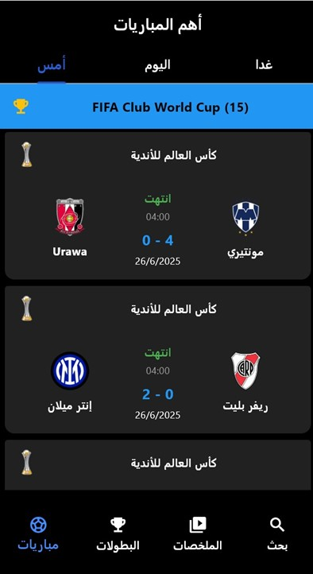
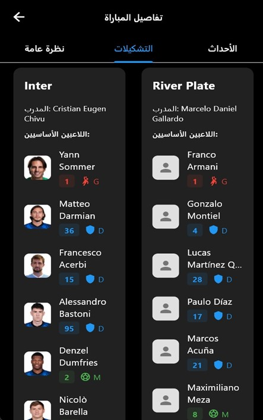
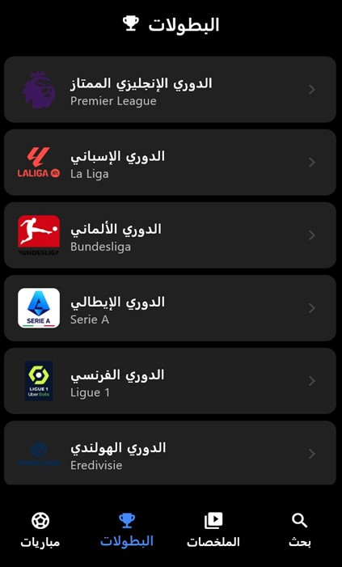
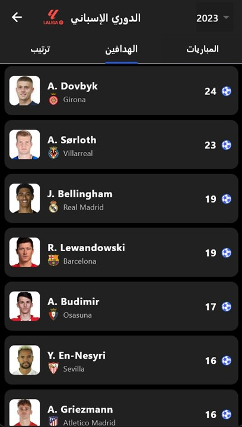
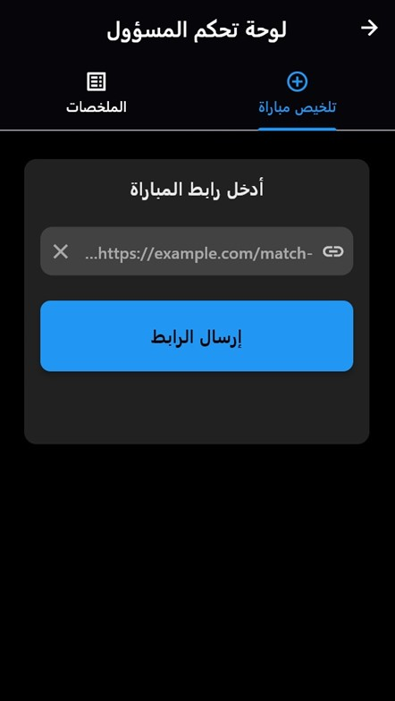
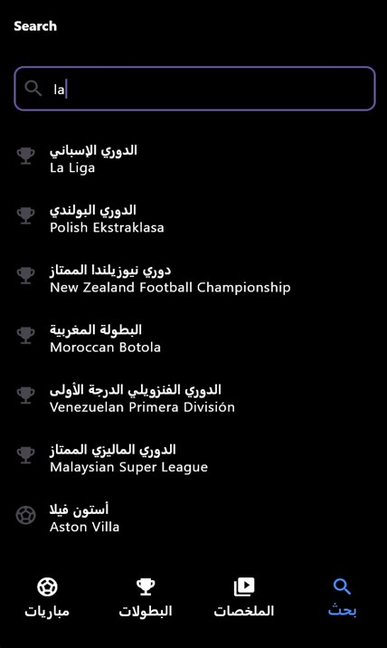
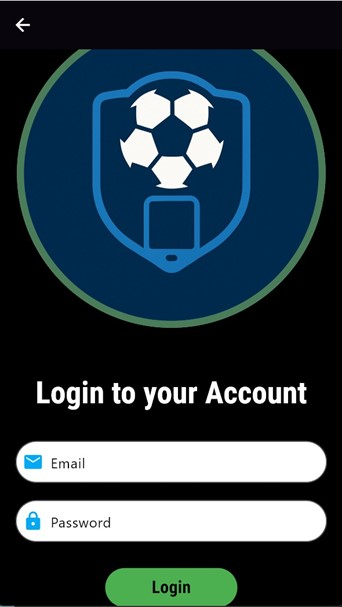

# AI-Football-Match-Summaries

## 📱 Overview

Smart Football App is a comprehensive Flutter application providing advanced football services, including:

* **Automatic video summarization** using AI
* **Arabic-friendly user interface**

##  Technical Stack

### Frontend

* **Flutter** - Cross-platform framework
* **Dart** - Programming language
* **Material Design** - UI design
* **Media Kit** - Video playback
* **HTTP** - Server communication

### Backend

* **FastAPI** - Python framework for APIs
* **OpenCV** - Video processing
* **YOLO** - Object detection in videos
* **Whisper** - Speech-to-text
* **yt-dlp** - Download videos

## 🚀 Key Features

### 1. Match Tracking

* Display matches by date (Yesterday, Today, Tomorrow)
* Filter by major leagues
* Detailed match information
* Translation of team and league names to Arabic

### 2. Smart Summarization

* Download videos from YouTube links
* Automatic video analysis using AI
* Detect key moments (goals, chances, refereeing events)
* Generate concise and useful Summaries
* Support Arabic language in analysis

### 3. Content Management

* Administrative interface for Summaries
* User interface for viewing Summaries


## 📁 Project Structure

```
flutter_application_1/
├── lib/                          # Main Flutter code
│   ├── components/               # Shared components
│   ├── config/                   # App configuration
│   ├── constants/                # Constants and translations
│   ├── linker/                   # API connection services
│   ├── screens/                  # App screens
│   ├── services/                 # API services
│   ├── theme/                    # App theming
│   └── widgets/                  # UI widgets
├── backend/                      # Backend server
│   ├── FastAPIserver/            # FastAPI server
│   │   ├── find_best/            # Key moments detection
│   │   ├── important/            # Key moments processing
│   │   ├── merge_voice_video/    # Audio-video merging
│   │   ├── match_sum/            # Match summarization
│   │   ├── read/                 # Video reading & processing
│   │   ├── team_assigner/        # Team assignment
│   │   ├── trackers/             # Object tracking
│   │   ├── utils/                # Utility functions
│   │   ├── voice_analysis/       # Audio analysis
│   │   └── models/               # AI models
│   ├── DownloadedMatches/        # Downloaded videos
│   └── summarises/               # Generated Summary
└── images/                       # Images and icons
```

## 🛠️ Installation & Running

### System Requirements

* Flutter SDK 3.2.3 or higher
* Python 3.8 or higher
* FFmpeg (for video playback)


### Frontend Setup

```bash
# Install dependencies
flutter pub get

# Run the app
flutter run
```

### Backend Setup

```bash
cd backend/FastAPIserver

# Install dependencies
pip install -r requirements.txt

# Run the server
python main.py
```

### Environment Variables

Create file `lib/config/api_config.dart`:

```dart
class ApiConfig {
  static const String footballApiKey = 'YOUR_FOOTBALL_API_KEY';
  static const String serverUrl = 'http://localhost:8000';
}
```

## 🔧 Configuration

### Football API Setup

* Obtain an API key from [API-Football](https://www.api-football.com/)
* Add the key in `api_config.dart`

### Server Setup

* Adjust server IP in `main.py`
* Set up download and summary folders
* Configure AI models

## 📊 Supported Leagues

### Major European Leagues

* English Premier League
* La Liga
* Bundesliga
* Serie A
* Ligue 1
* UEFA Champions League
* UEFA Europa League

### Arab Leagues

* Saudi Pro League
* UAE Arabian Gulf League
* Qatar Stars League
* Egyptian Premier League
* Moroccan League
* Tunisian Ligue 1

### International Competitions

* FIFA World Cup
* Copa America
* Africa Cup of Nations
* AFC Asian Cup

## 🤖 AI Techniques

### Key Moments Detection

* **YOLO Model**: Player and ball detection
* **Object Tracking**: Track object movements
* **Event Detection**: Identify key events

### Audio Analysis

* **Whisper Model**: Convert commentary audio to text
* **Audio Analysis**: Analyze tone and emotion
* **Moment Classification**: Classify events by importance

### Video Processing

* **Frame Extraction**: Extract key frames
* **Video Merging**: Merge important moments
* **Quality Optimization**: Enhance final video quality

## 🌐 APIs

### Football API

* Retrieve match information
* Team and player data
* League statistics


## 📱 App Screens

### 1. Matches Screen

* Display matches by date
* Filter by league
* Detailed match information
 
 <br><br>

### 2. Leagues Screen

* List supported leagues
* Team standings
* League statistics





<br>
<br>

### 3.Summary Screen

* View available Summaries
* Play videos
* Manage content
  



<br><br>

### 4. Search Screen

* Search matches
* Search teams
* Search leagues
<br>

<br><br>

### 5. Login Screen

* User login
* New user registration
* Account management
  <br><br>
  

<br><br>


## 🔄 Future Updates

### Planned Features

* Support more leagues
* Improve AI accuracy
* Add match notifications
* Live streaming support
* Advanced statistics analysis

### Technical Improvements

* Faster processing
* Lower resource usage
* Better user experience

